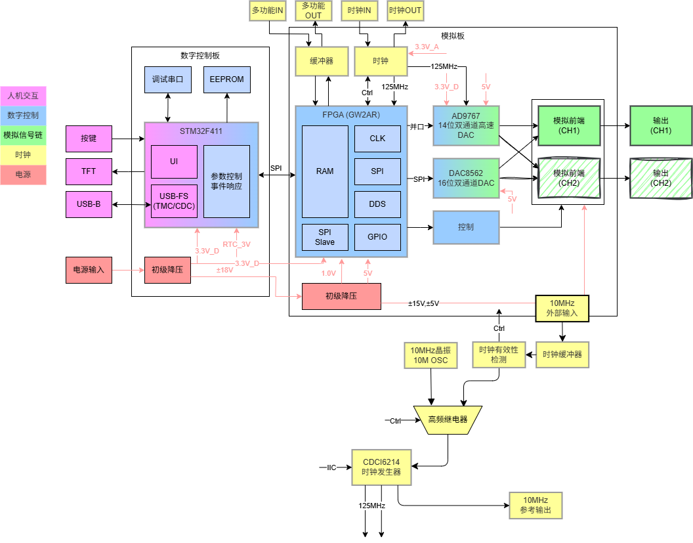
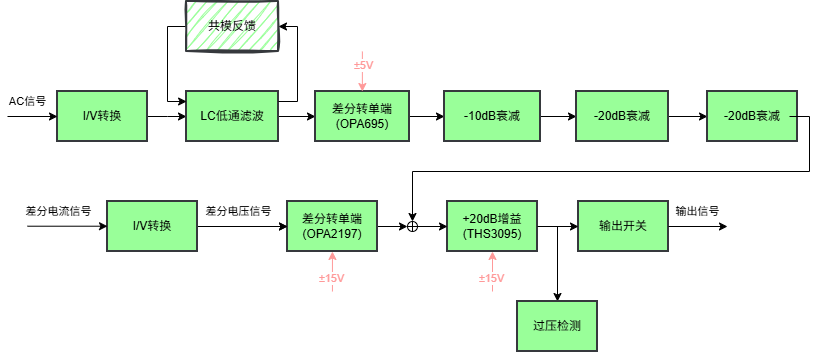
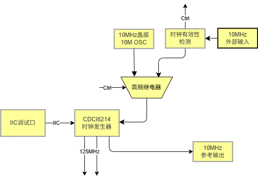
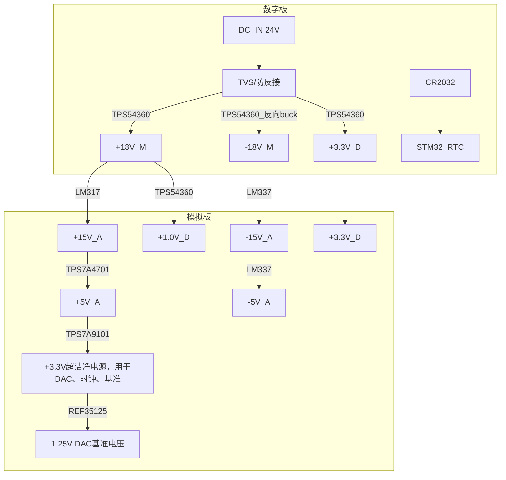

<!------------------------------------------------------------------------
SPDX-License-Identifier: CC-BY-SA-4.0
Copyright (C) 2026 [Your Name/Organization]

This work is licensed under the Creative Commons Attribution-ShareAlike 4.0 International License. 
To view a copy of this license, visit http://creativecommons.org/licenses/by-sa/4.0/.
------------------------------------------------------------------------->

<!-- Assisted-by: DeepSeek - 文档框架 -->

# ArbWave30 硬件架构文档

| 文档编号 | ArbWave30-HAD-001 | 版本 | V1.2 |
|---------|--------------|------|------|
| 项目名称 | ArbWave30 | 日期 | 2026-04-21 |
| 起草人 | EERNINUO | 状态 | 草案 |

## 1. 概述
ArbWave30采用**FPGA + MCU异构架构**：FPGA负责高速DDS波形生成与实时数据处理，MCU负责USB通信、SCPI解析、人机交互与系统状态管理。模拟前端分为差分转单端、重构滤波、可变增益放大、功率输出四级。数字与模拟部分采用分板设计（通过板对板连接器连接），以优化信号完整性与电源噪声。

## 2. 系统框图

## 3. 模块划分与功能定义

### 3.1 控制模块（MCU）（数字板）
- **型号**：STM32F411（暂定）
- **职责**：
  - USB USBTMC/CDC 协议栈
  - SCPI 命令解析与响应
  - 非实时参数存储（EEPROM模拟）
  - 控制FPGA（频率、波形、幅度系数、相位等）
  - 读取用户按键/编码器（未来GUI）
- **接口**：

| 接口名 | 方向 | 协议 | 连接到 | 备注 |
|--------|------|------|--------|------|
| USB_DP/DM | 双向 | USB 2.0 FS | PC | CDC或TMC |
| SPI1_CS/SCK/MOSI | 输出 | SPI | FPGA | 配置DDS参数 |
| SPI2_CS/SCK/MOSI | 输出 | SPI | TFT LCD / OLED | 面板显示（后续实现） |
| GPIO | 输出 | GPIO | 按键 | 前面板输入 |
| UART_TX/RX | 输出 | 115200 | 调试串口 | 预留 |
| IIC_SDA/SCL | 双向 | I2C | EEPROM | 存储配置数据 |

### 3.2 波形合成模块（FPGA + DAC）（模拟板）
- **FPGA**：高云 GW2AR-LV18 (LQFP-144)
- **职责**：
  - DDS 相位累加器（48bit，满足1μHz分辨率）
  - 波形存储器（ROM/RAM）：预置正弦、方波、三角、锯齿、阶梯
  - 数字幅度控制（乘法器，14bit输出）
  - 与DAC的并行接口时序产生
  - 频率/相位/幅度字实时更新（无毛刺）
- **DAC**：AD9767（14bit, 125MSPS, 双通道，当前仅用通道A）
- **接口**：
  - DAC数据线：14×2条（双通道），从FPGA输出，等长布线
  - DAC时钟：由时钟发生器提供125MHz LVCMOS
  - FPGA配置：SPI接口由MCU控制，支持在线更新DDS参数
  - FPGA程序配置：SPI Flash（外部），通过JTAG烧录

### 3.3 偏置发生模块（模拟板）
- **职责**：
  - 产生±5V偏置电压，用于模拟前端
- **关键要求**：
  - 偏置电压精度：±1mV
  - 偏置电压范围：±2V (经过末级放大后可至±10V)
  - **DAC**：DAC8562（16bit, 1MSPS, 双通道）
  - **运放**：OPA2197（轨到轨输出，低噪声，低功耗）
  - **接口**：
  - DAC控制总线：SPI, 由FPGA控制

### 3.4 模拟前端（AFE）

| 级 | 功能 | 关键要求 | 信号最大摆幅 | 增益(V/V) | 初步选型 |
|----|------|---------|---------|--|---------|
| 0 | DAC输出 | / | (差分电流输出) | / | AD9767 |
| 1 | 重构滤波器（低通） | 5阶椭圆，截止35MHz，带内波动<0.5dB，90MHz抑制>60dB |  |  | 无源LC（设计值） | 
| 2 | 差分转单端 | 带宽 > 150MHz，低噪声 | 4Vpp |  | OPA695 |
| 3 | 衰减网络 | 带宽 > 35MHz | 4Vpp |  | 0.1%精密电阻衰减网络（信号继电器控制） |
| 4 | 输出放大级 | SR > 2000V/us, 输出电流 > 200mA, 输出电压 > ±10V | 20Vpp | 10 |THS3095（电流反馈） |
| 5 | 共电位反馈 | 高精度、低噪声 | / | / | OP07 |
| 6 | 偏置产生 | ±2V输出 | / | / | DAC8562 OPA2197 |

### 3.5 时钟电路

- 本地振荡器：10 MHz TCXO，频率稳定度 ±1 ppm
- 时钟发生器：CDCI6214，RMS抖动 < 500 fs，支持外部参考输入
  - 输出 1：125 MHz LVCMOS 给 DAC 作为采样时钟
  - 输出 2：125 MHz LVCMOS 给 FPGA 内部时钟
  - 输出 3：10 MHz LVCMOS 参考输出
- 外部参考输入：SMA 端子，通过继电器切换内部 TCXO 或外部 10 MHz

### 3.6 电源系统 (初步设计)
- 输入：24V DC（TVS保护、防反接）[^1]。
- 电源架构：

- 电源滤波与去耦：每个电压轨配备 LC 滤波器和多级旁路电容，单板内模拟与数字电源不分割[^2]，DAC和运放供电采用低噪声LDO。

[^1]: THS3095在±15V供电时输出电压摆幅为±12.1V，考虑到电压降和余量，建议输入电压不低于20V。后续可根据实际测试调整输入电压范围。

[^2]: 比起纠结是否分割不同的地平面，保证信号的回流路径才是关键。本设计中波形合成模块(模拟板)上数字信号频率较高，因此信号回流基本沿着信号线下方，通过地平面回流到电源输入端，模拟电源和数字电源共用一个地平面，能确保回流路径短且连续，如果分割地平面破坏了回流路径，使得信号回流绕行，反而可能增加噪声和干扰。

### 3.7 接口与连接器
- USB：Micro-B，连接 STM32
- 波形输出：SMA，并联 50Ω/高阻继电器
- 外部 10M 输入：SMA，3.3V 电平
- 10M 参考输出：SMA，3.3V LVCMOS
- 多功能输出：SMA，3.3V 电平，通过74HCT125缓冲与电平转换
- 多功能输入：SMA，3.3V/5V 兼容，通过74HCT125缓冲
- 电源输入：2.5mm 插孔，反接保护

### 3.8 分板设计与板间接口
为实现最优信号完整性和电源噪声隔离，ArbWave30 采用双板分离架构：模拟板承载高速混合信号链路（FPGA、DAC、模拟前端），控制板负责低速数字逻辑与外部通信（MCU、USB、电源输入、触发 I/O）以及电源的初步调理，两板电源轨相互独立，连接到同一个电源输入。两板之间通过连接器相连。

#### 3.8.1 分板理由
|考量因素 | 分板优势|
|--------|---------|
|电源噪声 | 模拟板上的 DAC 和运放对电源纹波极其敏感（要求 < 50µV），控制板上的 DC-DC 和数字逻辑会产生高频开关噪声，物理分离可显著降低耦合。|
|信号完整性 | FPGA 与 DAC 之间的 14 位并行数据（125MHz）对 PCB 布局等长要求高，独占一板可保证最短、最可控的走线。|
|调试与测试	| 两块板可独立上电调试，先验证数字通信与 DDS，再联调模拟前端，降低故障定位难度。|
|复用性 | 未来升级任意波或双通道时，只需修改模拟板（如增加第二路 DAC），控制板可保持不变。|

#### 3.8.2 功能划分
| 板卡 | 包含模块 | 职责 |
|---|---|---|
| 控制板 | STM32F411、USB 接口、电源输入（20~36V）及初级 DC-DC、触发 I/O、EEPROM、前面板按键预留 | SCPI 解析、USB 通信、系统状态管理、模拟板配置、电源转换 |
|模拟板	| FPGA（GW2AR）、DAC（AD9767）、时钟发生器（CDCI6214）、模拟前端、衰减网络、固定增益放大、输出继电器 | DDS 波形合成、DAC 时序、模拟信号调理、波形输出 |

#### 3.8.3 板间接口信号
两板通过 2×6 针双排排针（间距 2.54mm） 连接。接口信号如下：

| 信号名 | 方向 | 电平 | 说明 |
|----|----|----|----|	
| +3.3V_D | 电源 | 3.3V | 数字电源，控制板提供，模拟板使用 |
| SPI_CS  | 控制板 → 模拟板 | 3.3V | SPI 片选（低有效）|
| SPI_CLK | 控制板 → 模拟板 | 3.3V | SPI 时钟，最大 10MHz|
| SPI_MOSI | 控制板 → 模拟板 | 3.3V | 主出从入（配置 DDS 参数）|
| SPI_MISO | 模拟板 → 控制板 | 3.3V | 主入从出（FPGA 状态回读）|
| FPGA_NRST | 控制板 → 模拟板 | 3.3V | 复位 FPGA（低有效）|
| GND | - | - | 地线，分散排布|

- 未使用的排针引脚预留为 NC 或备用 GPIO。

#### 3.8.5 连接器与机械布局
- 连接器类型：2×10 针排母（控制板） + 排针（模拟板），镀金防氧化。

#### 3.8.6 接地策略

- 控制板与模拟板共地。
- 所有板内信号线不跨接地平面缝隙，确保回流路径连续。

## 4. 关键接口信号定义

| 接口 | 信号 | 方向 | 电平 | 说明 |
|------|------|------|------|------|
| SPI (MCU <-> FPGA) | CLK, CS, MOSI, MISO | 双向 | 3.3V | 配置波形参数、DDS频率字 |
| 主 DAC 接口 (FPGA -> DAC) | D[13:0], DAC_CLK, WRT (单通道) | FPGA输出 | 3.3V | 并行数据，时钟沿对齐 |
| 偏置 DAC 接口 (FPGA -> DAC) | SCLK, MOSI, CS | FPGA输出 | 3.3V |  |
| 控制信号 (FPGA -> 继电器) |  | FPGA输出 | 3.3V | 通过三极管驱动 |
| SPI (MCU -> TFT) | SCLK, MOSI, CS | MCU输出 | 3.3V | 面板显示控制 |
| IIC (MCU -> 时钟发生器) | SDA, SCL | MCU输出 | 3.3V | 配置时钟发生器 |

## 5. 电源预算与噪声要求（初步）

#### 模拟板
| 电压轨 | 预估最大电流 | 允许纹波 (峰峰值) | 主要负载 |
|--------|-------------|-------------------|----------|
| +15V | 800mA | 2mV | 运放正电源，后级+5V_A |
| -15V | 500mA | 2mV | 运放负电源，后级-5V_A |
| +5V_A | 200mA | 200uV | 运放正电源、DAC、后级+3.3V_A |
| -5V_A | 100mA | 500uV | 运放负电源 |
| +3.3V_A | 100mA | 100uV | TCXO、时钟发生器、精密基准源 |
| +3.3V_D | 80mA | 50mV | FPGA IO |
| +1.0V | 1A | 30mV | FPGA 内核 |

#### 控制板
| 电压轨 | 预估最大电流 | 允许纹波 (峰峰值) | 主要负载 |
|--------|-------------|-------------------|----------|
| +3.3V_D | 200mA | 50mV | STM32、USB |
| +3.0V_RTC | 2uA | 10uV | RTC 模块 | 

## 6. 物理与机械约束
- PCB 尺寸：最大 100mm × 100mm
- 连接器布局：SMA 间距 20mm，USB 位于板边
- 散热：
  1. THS3095 底部加过孔阵列并连接至底层铜皮
  2. FPGA 加散热器

## 7. 下一步工作
- 编写硬件设计文档（原理图设计说明、PCB 布局指南）
- 开始 LTSpice 仿真

## 8. 版本记录

| 版本 | 日期 | 修改内容 |
|------|------|----------|
| V1.0 | 2026-04-06 | 初始架构 |
| V1.1 | 2026-04-20 | 添加电源系统初步设计，添加系统框图，完善模拟前端 |  
| V1.2 | 2026-04-21 | 添加时钟模块设计 |
| V1.3 | 2026-04-23 | 添加多功能I/O特性，完善板间接口定义 |