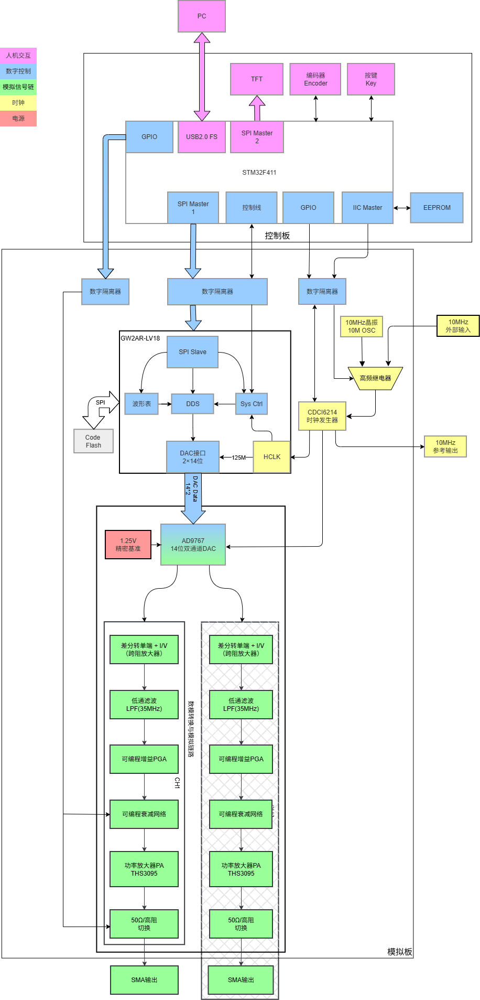
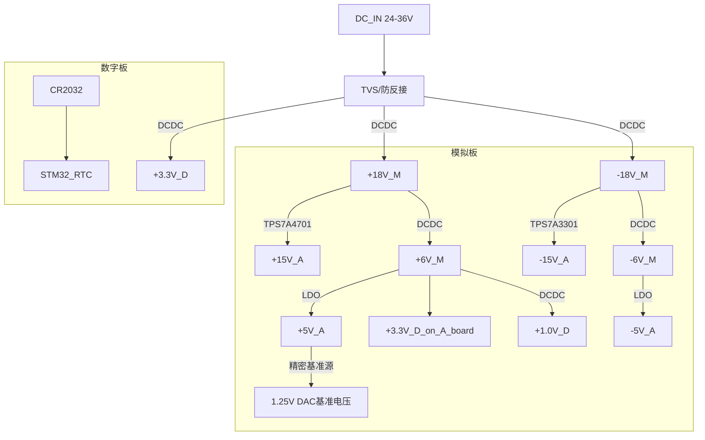

<!------------------------------------------------------------------------
SPDX-License-Identifier: CC-BY-SA-4.0
Copyright (C) 2026 [Your Name/Organization]

This work is licensed under the Creative Commons Attribution-ShareAlike 4.0 International License. 
To view a copy of this license, visit http://creativecommons.org/licenses/by-sa/4.0/.
------------------------------------------------------------------------->

# ArbWave30 硬件架构文档

| 文档编号 | ArbWave30-HAD-001 | 版本 | V1.0 |
|---------|--------------|------|------|
| 项目名称 | ArbWave30 | 日期 | 2026-04-06 |
| 起草人 | EERNINUO | 状态 | 草案 |

## 1. 概述
ArbWave30采用**FPGA + MCU异构架构**：FPGA负责高速DDS波形生成与实时数据处理，MCU负责USB通信、SCPI解析、人机交互与系统状态管理。模拟前端分为差分转单端、重构滤波、可变增益放大、功率输出四级。数字与模拟部分采用**分板设计**（通过板对板连接器与数字隔离器连接），以优化信号完整性与电源噪声。

## 2. 系统框图

## 3. 模块划分与功能定义

### 3.1 控制模块（MCU）（数字板）
- **型号**：STM32F411（暂定）
- **职责**：
  - USB USBTMC/CDC 协议栈
  - SCPI 命令解析与响应
  - 非实时参数存储（EEPROM模拟）
  - 控制FPGA（频率、波形、幅度系数、相位等）
  - 读取用户按键/编码器（未来GUI）
- **接口**：

| 接口名 | 方向 | 协议 | 连接到 | 备注 |
|--------|------|------|--------|------|
| USB_DP/DM | 双向 | USB 2.0 FS | PC | CDC或TMC |
| SPI1_CS/SCK/MOSI | 输出 | SPI | FPGA | 配置DDS参数 |
| SPI2_CS/SCK/MOSI | 输出 | SPI | TFT LCD / OLED | 面板显示（后续实现） |
| GPIO | 输出 | GPIO | 模拟前端 | 增益/衰减控制 |
|   | 输入 | GPIO | 按键 | 前面板输入 |
| UART_TX/RX | 输出 | 115200 | 调试串口 | 预留 |
| IIC_SDA/SCL | 双向 | I2C | EEPROM | 存储配置数据 |
|     |      |     | CDCI6214 | 时钟发生器配置 |

### 3.2 波形合成模块（FPGA + DAC）（模拟板）
- **FPGA**：高云 GW2AR-LV18 (LQFP-144)
- **职责**：
  - DDS 相位累加器（48bit，满足1μHz分辨率）
  - 波形存储器（ROM/RAM）：预置正弦、方波、三角、锯齿、阶梯
  - 数字幅度控制（乘法器，14bit输出）
  - 与DAC的并行接口时序产生
  - 频率/相位/幅度字实时更新（无毛刺）
- **DAC**：AD9767（14bit, 125MSPS, 双通道，当前仅用通道A）
- **接口**：
  - DAC数据线：14×2条（双通道），从FPGA输出，等长布线
  - DAC时钟：由时钟发生器提供125MHz LVCMOS
  - FPGA配置：SPI接口由MCU控制，支持在线更新DDS参数
  - FPGA程序配置：SPI Flash（外部），通过JTAG烧录

### 3.3 模拟前端（AFE）
| 级 | 功能 | 关键要求 | 初步选型 |
|----|------|----------|----------|
| 1 | 差分转单端 + 共模滤波 | 带宽 > 150MHz，低噪声 | 待定 |
| 2 | 重构滤波器（低通） | 5阶椭圆，截止35MHz，带内波动<0.5dB，阻带抑制>45dB | 无源LC（设计值） |
| 3 | 可变增益放大器 |  | 待定 |
| 4 | 功率输出级 | 驱动高阻负载至±10V，SR > 1000V/μs[^1] | THS3095（电流反馈） |
| 5 | 输出阻抗切换 | 50Ω / 高阻，继电器 |  |

[^1]: 压摆率计算如下：待补充

### 3.4 时钟电路
- 本地振荡器：10 MHz TCXO，频率稳定度 ±1 ppm
- 时钟发生器：CDCI6214，RMS抖动 < 500 fs，支持外部参考输入
  - 输出 1：125 MHz LVCMOS 给 DAC 作为采样时钟
  - 输出 2：125 MHz LVDS 给 FPGA 内部时钟
  - 输出 3：10 MHz LVCMOS 参考输出
- 外部参考输入：SMA 端子，通过继电器切换内部 TCXO 或外部 10 MHz

### 3.5 电源系统 (初步设计)
- 输入：24~36V DC（TVS保护、防反接）[^2]。
- 电源架构：

- 电源滤波与去耦：每个电压轨配备 LC 滤波器和多级旁路电容，单板内模拟与数字电源不分割[^3]，DAC和运放供电采用低噪声LDO。

[^2]: THS3095在±15V供电时输出电压摆幅为±12.1V，考虑到电压降和余量，建议输入电压不低于18V。后续可根据实际测试调整输入电压范围。36V上限考虑到常见的电源适配器规格和安全余量。

[^3]: 比起纠结是否分割不同的地平面，保证信号的回流路径才是关键。本设计中波形合成模块(模拟板)上数字信号频率较高，因此信号回流基本沿着信号线下方，通过地平面回流到电源输入端，模拟电源和数字电源共用一个地平面，能确保回流路径短且连续，如果分割地平面破坏了回流路径，使得信号回流绕行，反而可能增加噪声和干扰。

### 3.6 接口与连接器
- USB：Micro-B，连接 STM32
- 波形输出：SMA，并联 50Ω/高阻继电器
- 外部 10M 输入：SMA
- 触发 I/O：SMA，3.3V 电平
- 电源输入：D10M_TCXO.1/2.5mm 插孔，反接保护

### 3.7 分板设计与板间接口
为实现最优信号完整性和电源噪声隔离，ArbWave30 采用双板分离架构：模拟板承载高速混合信号链路（FPGA、DAC、模拟前端），控制板负责低速数字逻辑与外部通信（MCU、USB、电源输入、触发 I/O）。两板之间通过连接器与数字隔离器相连。

#### 3.7.1 分板理由
|考量因素 | 分板优势|
|--------|---------|
|电源噪声 | 模拟板上的 DAC 和运放对电源纹波极其敏感（要求 < 50µV），控制板上的 DC-DC 和数字逻辑会产生高频开关噪声，物理分离可显著降低耦合。|
|信号完整性 | FPGA 与 DAC 之间的 14 位并行数据（125MHz）对 PCB 布局等长要求高，独占一板可保证最短、最可控的走线。|
|调试与测试	| 两块板可独立上电调试，先验证数字通信与 DDS，再联调模拟前端，降低故障定位难度。|
|复用性 | 未来升级任意波或双通道时，只需修改模拟板（如增加第二路 DAC），控制板可保持不变。|

#### 3.7.2 功能划分
| 板卡 | 包含模块 | 职责 |
|---|---|---|
| 控制板 | STM32F411、USB 接口、电源输入（20~36V）及初级 DC-DC、触发 I/O、EEPROM、前面板按键预留 | SCPI 解析、USB 通信、系统状态管理、模拟板配置、电源转换 |
|模拟板	| FPGA（GW2AR）、DAC（AD9767）、时钟发生器（CDCI6214）、模拟前端（差分放大→滤波→VGA→功率级）、输出继电器 | DDS 波形合成、DAC 时序、模拟信号调理、波形输出 |

#### 3.7.3 板间接口信号
两板通过 2×10 针双排排针（间距 2.54mm） 连接，中间串接 数字隔离器（置于控制板上）。接口信号如下：

| 信号名 | 方向 | 电平（隔离前） | 说明 |
|----|----|----|----|	
| 3.3V供电 | 控制板 → 模拟板 | 3.3V | 为隔离器源端供电 |
| SPI_CS  | 控制板 → 模拟板 | 3.3V | SPI 片选（低有效）|
| SPI_CLK | 控制板 → 模拟板 | 3.3V | SPI 时钟，最大 10MHz|
| SPI_MOSI | 控制板 → 模拟板 | 3.3V | 主出从入（配置 DDS 参数）|
| SPI_MISO | 模拟板 → 控制板 | 3.3V | 主入从出（FPGA 状态回读）|
| FPGA_RST | 控制板 → 模拟板 | 3.3V | 复位 FPGA（低有效）|
| GND | - | - | 4 根地线，分散排布|

> 未使用的排针引脚预留为 NC 或备用 GPIO。

#### 3.7.4 数字隔离器选型（暂定）
采用多片 ADI ADuM1401（四通道单向隔离器），关键参数：
- 隔离电压：2.5 kV RMS（满足仪器安全要求）
- 传播延迟：< 32 ns（典型 20 ns），允许 SPI 时钟 ≤ 10 MHz
- 工作速率：DC 至 90 Mbps（远高于 SPI 需求）
- 通道配置：3 个正向通道（控制板→模拟板） + 1 个反向（模拟板→控制板）
映射关系：
  - VIA → SPI_MOSI
  - VIB → SPI_CLK
  - VIC → SPI_CS / FPGA_RST（共用通道，由 MCU 控制时序）
  - VOD ← SPI_MISO（反向）
  
隔离器位于**模拟板**侧，其两边电源由各板上的3.3V_D电源提供（，确保两板之间无直流电流路径。

#### 3.7.5 连接器与机械布局
- 连接器类型：2×10 针排母（控制板） + 排针（模拟板），镀金防氧化。

#### 3.7.6 接地策略
- 控制板与模拟板不共地。
- 数字隔离器跨越地分割，其副边地（模拟板侧）直接连接模拟板的地平面。
- 所有板间信号线不跨接地平面缝隙，确保回流路径连续。

## 4. 关键接口信号定义

| 接口 | 信号 | 方向 | 电平 | 说明 |
|------|------|------|------|------|
| SPI (MCU ↔ FPGA) | CLK, CS, MOSI, MISO | 双向 | 3.3V | 配置波形参数、DDS频率字 |
| DAC 接口 (FPGA → DAC) | D[13:0], DAC_CLK, WRT (单通道) | FPGA输出 | 3.3V | 并行数据，时钟沿对齐 |
| SPI (MCU → TFT) | SCLK, MOSI, CS | MCU输出 | 3.3V | 面板显示控制 |	
| 控制信号 (MCU → 继电器) |  | MCU输出 | 3.3V | 通过三极管驱动 |

## 5. 电源预算与噪声要求（初步）

| 电压轨 | 预估最大电流 | 允许纹波 (峰峰值) | 主要负载 |
|--------|-------------|-------------------|----------|
| +16V | 300mA | 50mV | DC-DC 输入 |
| -16V | 300mA | 500uV | 运放、VGA |
| -5V_A | 待补充 | 500uV | 负电源运放 |
| +3.3V_D | 待补充 | 50mV | STM32、FPGA IO |
| +1.0V | 待补充 | 30mV | FPGA 内核 |

## 6. 物理与机械约束
- PCB 尺寸：100mm × 100mm
- 连接器布局：SMA 间距 20mm，USB 位于板边
- 散热：THS3095 底部加过孔阵列并连接至底层铜皮

## 7. 下一步工作
- 完成各模块具体选型（运放、VGA、时钟发生器型号）
- 编写硬件设计文档（原理图设计说明、PCB 布局指南）
- 开始 LTSpice 仿真

## 8. 版本记录

| 版本 | 日期 | 修改内容 |
|------|------|----------|
| V1.0 | 2026-04-06 | 初始架构 |