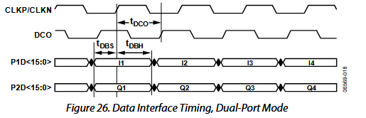

<!------------------------------------------------------------------------
SPDX-License-Identifier: CC-BY-SA-4.0
Copyright (C) 2026 [Your Name/Organization]

This work is licensed under the Creative Commons Attribution-ShareAlike 4.0 International License. 
To view a copy of this license, visit http://creativecommons.org/licenses/by-sa/4.0/.
------------------------------------------------------------------------->

<!-- Assisted-by: DeepSeek - 文档框架 -->

# ArbWave30 – 模拟板硬件设计文档

| 文档编号 | ArbWave30-HDD-001 | 版本 | V1.0  |
| --------| ----------------- | ---- | ----- |
| 项目名称 | ArbWave30 | 日期 | 2026-04-24 |
| 起草人   | EERNINUO | 状态 | 设计中 |

## 1. 板卡概述
- 功能定位：FPGA读取控制板发送的命令，控制DAC和模拟前端实现波形输出
- 关键性能指标：功耗、尺寸、环境要求
  - 功耗: < 10W
  - 尺寸：< 100mm x 100mm
  - 环境要求：0 ~ 40 ℃
- 主要接口：对外连接器（电源、信号、控制）
  - 对外连接器：
    - 波形输出（CH1、CH2）：SMA 输出
    - 时钟输入/输出：SMA 接口，单独小板，通过排线连接
    - 多功能输入/输出：SMA 接口，单独小板，通过排线连接 （可和时钟接口一板）
  - 板间接口：见[板间接口文档](./板间接口设计文档.md)

## 2. 模块详细设计
### 2.1 FPGA 与 DAC接口
- **原理图截图**：待补充
- **功能描述**：
  - 读取 MCU 发送的命令
  - 运行 DDS 算法
  - 控制 DAC 输出
  - 控制模拟前端
  
- **关键器件**：
  | 器件 | 型号 | 特性 | 选型理由 |
  |------|-----|------|----------|
  | FPGA | GW2AR-LV18EQ144C8/I7 | 20k LUTs，集成64M SDRAM | 见[FPGA选型ADR](./adr/001-fpga-select.md) |
  | Code Flash | GD25Q64ESIG | 64M | 国产Flash，价格相对较低，供应链稳定 |
  | 下载接口 | 2×5 2.54mm 牛角座 | \ | 标准接口 |
 
- **设计计算**：
  - 公式推导（如增益、截止频率、输出摆幅、功耗）
  - 代入数值计算，并与规格书对照
1. 数据线阻抗：
  当走线长度 \(L \geq \lambda / 10\) 时需匹配，其中 \(\lambda\) 为信号中的最高有效频率对应的波长。对于数字信号，最高有效频率近似为 \(f_{max} = 0.35 / t_r\)，查GW2AR数据手册可知，**上升沿时间** $t_r $**约为0.8ns**，信号在FR4材质的PCB中**传播速度**$v$**约为15cm/ns**，则理论最长安全走线长度为：
\[
\frac{\lambda}{10} = \frac{v}{10 f_{max}} = \frac{v \cdot t_r}{10 \times 0.35} = \frac{v \cdot t_r}{3.5} \approx 3.43 cm
\]

1. 时序要求：
  
  [硬件架构文档 3.2](#3.2_波形合成模块)中给出：DAC工作在 150MSPS 下，则 CLKP/CLKN 周期约为 6.7 ns。由数据手册可知，$t_{DCO} \approx 2.2ns$（典型值），则 DCO 上升沿约 4.2ns 后数据采样，$t_{DBS} > 400 ps $，则数据至少需在3.8ns内稳定，实际最好预留一定时间。

- **接口信号**：列出输入/输出信号名称、电平、阻抗、时序要求
  | 信号名称 | 电平 | 协议 | 阻抗 | 连接到 | 备注 |
  |----------|------|------|----------|----------|----------|
  | 50MHz 时钟输入 | LVDS25 | 差分 100Ω | \ | CDCI6214 | 系统时钟 |
  | MSPI 接口 | 3.3V | SPI | \ | code flash | 程序加载 |
  | 指令输入 | 3.3V | SPI | \ | MCU | 命令输入，MISO线靠近FPGA处串电阻 |
  | 模拟前端控制 | 3.3V | GPIO | \ | 信号继电器 | 通过三极管扩流 |
  | 时钟控制 | 3.3V | GPIO | \ | 信号继电器 | 通过三极管扩流 |
  | 多功能输入/输出 | 3.3V | GPIO | \ | 多功能输入/输出 | 通过74AHC125缓冲 |
  | DAC 数据接口 | 3.3V | 并口 | 50Ω(建议) | DAC | 数据线长度差 < 5mil |
  | DCO | 3.3V | \ | \ | DAC | 数据时钟，尽可能短 |
  | DAC 控制 | 3.3V | SPI | \ | DAC |  |
  | JTAG 下载接口 | 3.3V | JTAG | \ | JTAG | 添加 ESD 保护 |

- **具体设计**：
  - LVDS时钟输入：
    1. LVDS 输入连接到 FPGA 的 GCLK 引脚
    2. 长度差 < 5mil，总长 < 4000mil
    3. 差分走线，控100Ω阻抗；
    4. 终端 100Ω 电阻精度 > 1%
  - DAC 数据接口：
    1. 数据线长度差 < 5mil
    2. 数据线控 50Ω 阻抗
    3. 数据线始端预留串联电阻焊盘（先焊接0欧姆）
  - DCO数据时钟：
    1. 控 50Ω 阻抗
    2. 尽可能短
    3. 连接到 FPGA 的 GCLK 引脚

- **保护设计**：
  JTAG 添加 ESD 保护
- **测试点**：
  - 时钟输入
  - 多功能输入/输出
  - DAC 控制

### 2.2 DAC电路
- **原理图截图**（或链接）
- **功能描述**：该模块实现什么
- **关键器件**：型号、选型理由（性能、成本、供货）
- **设计计算**：
  - 公式推导（如增益、截止频率、输出摆幅、功耗）
  - 代入数值计算，并与规格书对照
- **接口信号**：列出输入/输出信号名称、电平、阻抗、时序要求
- **保护设计**：ESD、过流、过压、防反接等
- **测试点**：建议预留哪些测试点（TP_xxx）及用途

### 2.3 模拟前端
#### 2.3.1 重构滤波器 
- **原理图截图**（或链接）
- **功能描述**：该模块实现什么
- **关键器件**：型号、选型理由（性能、成本、供货）
- **设计计算**：
  - 公式推导（如增益、截止频率、输出摆幅、功耗）
  - 代入数值计算，并与规格书对照
- **仿真结果**（可选）：插入 LTspice/ADS 波形图
- **接口信号**：列出输入/输出信号名称、电平、阻抗、时序要求
- **保护设计**：ESD、过流、过压、防反接等
- **测试点**：建议预留哪些测试点（TP_xxx）及用途

#### 2.3.2 差分转单端
- **原理图截图**（或链接）
- **功能描述**：该模块实现什么
- **关键器件**：型号、选型理由（性能、成本、供货）
- **设计计算**：
  - 公式推导（如增益、截止频率、输出摆幅、功耗）
  - 代入数值计算，并与规格书对照
- **仿真结果**（可选）：插入 LTspice/ADS 波形图
- **接口信号**：列出输入/输出信号名称、电平、阻抗、时序要求
- **保护设计**：ESD、过流、过压、防反接等
- **测试点**：建议预留哪些测试点（TP_xxx）及用途

#### 2.3.3 衰减网络
- **原理图截图**（或链接）
- **功能描述**：该模块实现什么
- **关键器件**：型号、选型理由（性能、成本、供货）
- **设计计算**：
  - 公式推导（如增益、截止频率、输出摆幅、功耗）
  - 代入数值计算，并与规格书对照
- **仿真结果**（可选）：插入 LTspice/ADS 波形图
- **接口信号**：列出输入/输出信号名称、电平、阻抗、时序要求
- **保护设计**：ESD、过流、过压、防反接等
- **测试点**：建议预留哪些测试点（TP_xxx）及用途

#### 2.3.4 偏置产生与求和
- **原理图截图**（或链接）
- **功能描述**：该模块实现什么
- **关键器件**：型号、选型理由（性能、成本、供货）
- **设计计算**：
  - 公式推导（如增益、截止频率、输出摆幅、功耗）
  - 代入数值计算，并与规格书对照
- **仿真结果**（可选）：插入 LTspice/ADS 波形图
- **接口信号**：列出输入/输出信号名称、电平、阻抗、时序要求
- **保护设计**：ESD、过流、过压、防反接等
- **测试点**：建议预留哪些测试点（TP_xxx）及用途

#### 2.3.5 输出增益级
- **原理图截图**（或链接）
- **功能描述**：该模块实现什么
- **关键器件**：型号、选型理由（性能、成本、供货）
- **设计计算**：
  - 公式推导（如增益、截止频率、输出摆幅、功耗）
  - 代入数值计算，并与规格书对照
- **仿真结果**（可选）：插入 LTspice/ADS 波形图
- **接口信号**：列出输入/输出信号名称、电平、阻抗、时序要求
- **保护设计**：ESD、过流、过压、防反接等
- **测试点**：建议预留哪些测试点（TP_xxx）及用途
  <!-- 输出开关旁加指示灯指示通道状态 -->
-
#### 2.4 时钟生成
- **原理图截图**（或链接）
- **功能描述**：该模块实现什么
- **关键器件**：型号、选型理由（性能、成本、供货）
- **设计计算**：
  - 公式推导（如增益、截止频率、输出摆幅、功耗）
  - 代入数值计算，并与规格书对照
- **接口信号**：列出输入/输出信号名称、电平、阻抗、时序要求
- **保护设计**：ESD、过流、过压、防反接等
- **测试点**：建议预留哪些测试点（TP_xxx）及用途

### 2.5 电源与去耦 (#模拟板电源设计)
- **原理图截图**（或链接）
- **功能描述**：该模块实现什么
- **关键器件**：型号、选型理由（性能、成本、供货）
- **设计计算**：
  - 公式推导（如增益、截止频率、输出摆幅、功耗）
  - 代入数值计算，并与规格书对照
- **保护设计**：ESD、过流、过压、防反接等
- **测试点**：建议预留哪些测试点（TP_xxx）及用途

### 2.6 多功能 I/O
- **原理图截图**（或链接）
- **功能描述**：该模块实现什么
- **关键器件**：型号、选型理由（性能、成本、供货）
- **设计计算**：
  - 公式推导（如增益、截止频率、输出摆幅、功耗）
  - 代入数值计算，并与规格书对照
- **接口信号**：列出输入/输出信号名称、电平、阻抗、时序要求
- **保护设计**：ESD、过流、过压、防反接等
- **测试点**：建议预留哪些测试点（TP_xxx）及用途

## 3. PCB 布局与布线指南
- 层叠结构：4 层（信号-地-电源-信号）
- **关键等长约束**：DAC 数据线 14bit 与 DAC 时钟线之间长度差 < 50mil（或按数据手册计算）。
- **时钟线处理**：125MHz 时钟线应走在内层，上下左右包地，避免穿越其它信号区域。
- **模拟地与数字地**：在模拟板上，所有地在一个完整的平面上，不分割。但模拟部分和数字部分的回流路径应分开，通过布局实现：FPGA 和 DAC 的数字地靠近连接器，模拟前端的地靠近输出，最后在电源入口处单点连接。
- **去耦电容放置**：每个电源引脚一个 0.1μF + 一个 10μF，尽可能靠近 IC。
- **散热**：THS3095 底部加过孔阵列连接至底层铜皮并暴露面积，FPGA 可加散热片。

## 4. 调试与测试计划
### 4.1 测试点位置
所有电源轨、模拟前端的每一个节点，时钟线，以及关键控制信号（如 SPI 总线）预留测试点，方便后续调试和性能验证。
### 4.2 上电前检查清单（短路测试、电源电压测量）
电源对地短路、极性、焊接。
### 4.3 单板独立测试步骤：
分步上电：先焊电源部分，验证各电压轨；再焊时钟，测 125MHz；然后焊 FPGA，烧录代码；最后焊 DAC 和模拟前端。
关键波形测试点：
  - 电源纹波
  - 时钟波形（示波器观察）
  - SPI 信号（时钟、数据）波形
  - DAC 差分输出（滤波器前）
  - 滤波器输出
  - 差分转单端输出
  - 衰减器输出
  - 偏置电压
  - 最终输出
模块测试：
  - 时钟输出：用示波器测量 125MHz 波形和抖动（使用余辉模式）。
  - DAC 静态测试：FPGA 输出固定码，用万用表测量 DAC 输出电流。
  - 滤波器响应：使用网络分析仪nanoVNA（或信号源+示波器）扫描 S21。
  - 全链路测试：FPGA 产生 1MHz 正弦，观察输出幅值和失真。
  - 性能验证：按技术规格书中的测试方法进行。

## 5. 元器件清单（BOM 摘要）
- 只列出关键/易错器件（阻容感值、精度、封装、耐压、温度系数）
- 完整 BOM 另存为 CSV 文件，此处放链接

## 6. 仿真文件与参考资料
LTspice 仿真电路、Filter Solutions 设计文件。

关键数据手册页码索引。

## 7. 版本记录
| 版本 | 日期 | 修改内容 | 修改人 |
|------|------|----------|--------|
| V1.0 | 2026-04-24 | 初始版本 | EERNINUO |
