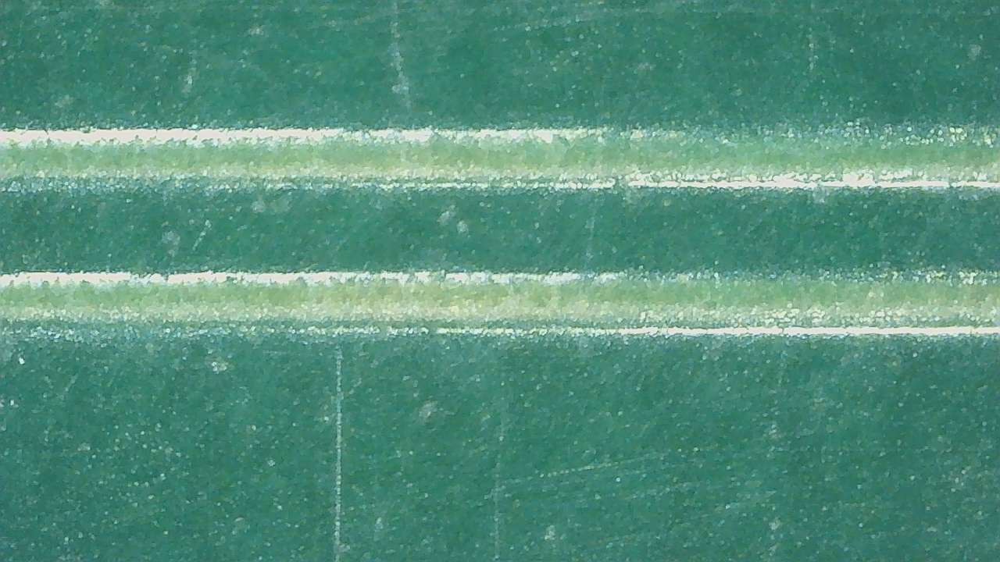
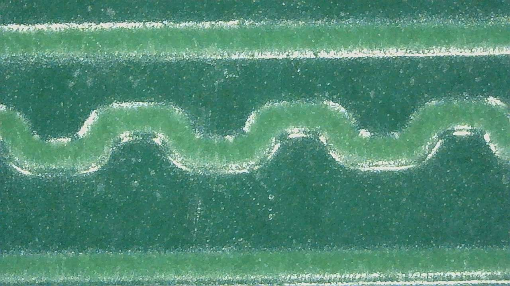
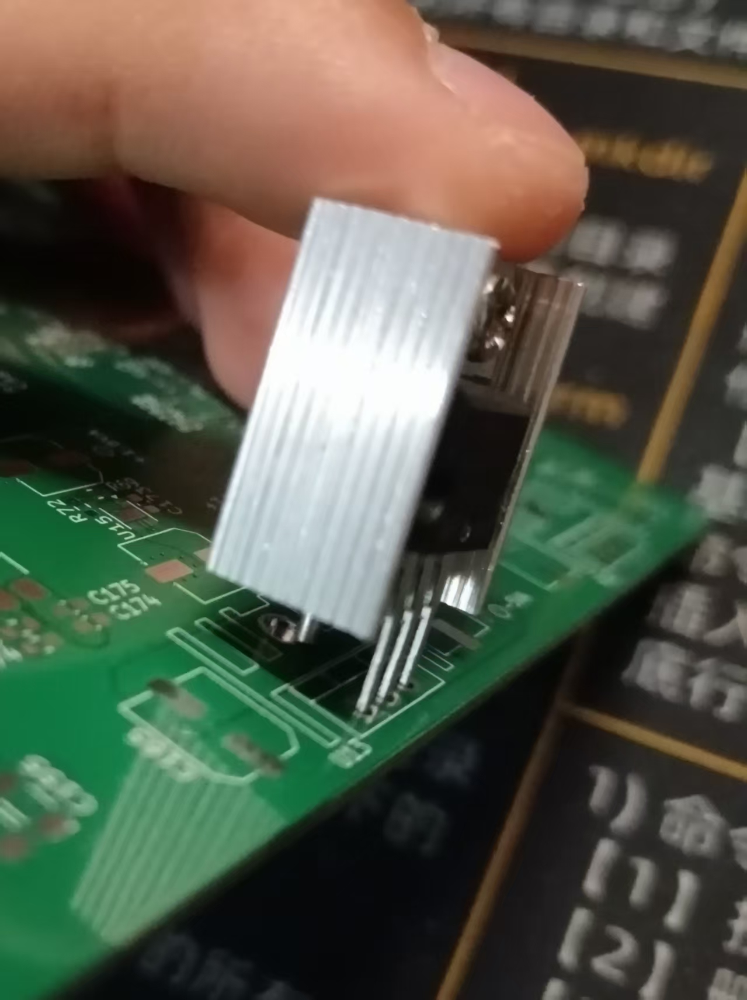

<!------------------------------------------------------------------------
SPDX-License-Identifier: CC-BY-SA-4.0
Copyright (C) 2026 [EERNINUO]

This work is licensed under the Creative Commons Attribution-ShareAlike 4.0 International License. 
To view a copy of this license, visit http://creativecommons.org/licenses/by-sa/4.0/.
------------------------------------------------------------------------->

<!-- Assisted-by: DeepSeek - 文档框架 -->

# ArbWave30 - 模拟板MVP调试笔记

## 外观检查
- **日期**：2026年6月13日
- **硬件版本**：v0.1.0-mvp
- **测试目的**：检查是否存在 PCB 工艺缺陷；检查封装与实物是否匹配
- **测试工具**：
    1. 数码显微镜
    2. 焊接所需物料
- **检查清单**：
  
| 序号 | 检查内容 | 检查结果 | 备注 |
| ---- | ---- | ---- | ---- |
| 1 | 检查封装与实物是否匹配 | ⚠️ 注意 | 散热片封装错误（详见“异常项描述”）|
| 2 | 检查阻焊颜色均匀性 | ⚠️ 注意 | 部分细走线颜色发黄（详见“异常项描述”） |
| 3 | 检查走线有无断线 | ✅通过 | 走线正常连通 |
| 4 | 丝印清晰度与位置 | ⚠️ 注意 | 部分丝印可选添加（详见“异常项描述”） |

- **异常项描述**
1. **阻焊层局部发黄（细走线区域）**
**[现象]** 在数码显微镜下，发现以下异常：

   - 时钟差分线（CLK_P/N，线宽6mil）表面的阻焊层呈淡黄色，与周围正常的绿色阻焊形成肉眼可辨的色差（如上图）。
   - 同样现象出现在另外三条线宽≤6mil的孤立走线上，而走线密集（比如 FPGA-DAC 接口处）及铜皮处阻焊正常（如下图）。

    
   - 酒精擦拭不变色，排除表面污染。

    **[分析与推测]**
   - 初步判断：黄色并非阻焊变质，而是底层铜色透过半透明阻焊层显色。细走线在电镀时因电流密度集中导致局部铜厚增加，表面高度抬升使覆盖的阻焊油墨实际厚度变薄，最终透出铜色。
   - 功能风险：当前不影响电气导通，但降低了该区域的机械防护和绝缘强度，后续组装或长期使用中更易划伤或受潮腐蚀。
   - 信号完整性风险：铜厚偏差会略微改变差分阻抗，对150MHz时钟的反射裕量影响有限，但在后续实测中需特别关注。

    **[行动计划]**
   - 电气验证：用万用表测量相邻细走线间绝缘电阻（>20MΩ，通过）。
   - 在后续测试中，若发现信号质量异常，将优先排查此项。
   - 若无异常，则可忽略此项，但需在组装时特别注意保护这些区域。

2. **散热片封装错误**

**[现象]** 发现散热片封装与实际实物不符（见上图）。
   - 散热片偏薄，导致装配冲突。

    **[行动计划]**
    - 可通过掰弯稳压器引脚来解决装配冲突问题。
    - 修改封装文件，确保散热片厚度符合实际尺寸。
    - 后级电源功耗不大，MVP 中保留散热片是为了保险起见，后续可根据实测情况酌情移除散热片。

3. **丝印可选添加**
**[现象]** JTAG 调试接口处无丝印标明引脚顺序，若需要用杜邦线连接需查看 Layout 文件。

    **[行动计划]**
    - 在丝印层添加引脚顺序标识，便于调试。
